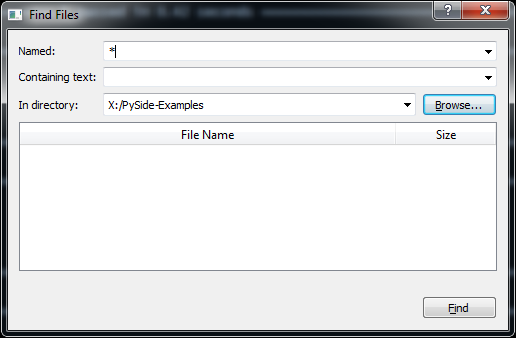

Tutorial
========

``pytest-qt`` registers a new fixture_ named ``qtbot``, which acts as *bot* in the sense
that it can send keyboard and mouse events to any widgets being tested. This way, the programmer
can simulate user interaction while checking if GUI controls are behaving in the expected manner.

.. _fixture: http://pytest.org/latest/fixture.html

To illustrate that, consider a widget constructed to allow the user to find files in a given
directory inside an application.

It is a very simple dialog, where the user enters a standard file mask, optionally enters file text
to search for and a button to browse for the desired directory. Its source code is available here_,

.. _here: https://github.com/nicoddemus/PySide-Examples/blob/master/examples/dialogs/findfiles.py

To test this widget's basic functionality, create a test function::

    def test_basic_search(qtbot, tmpdir):
        '''
        test to ensure basic find files functionality is working.
        '''
        tmpdir.join('video1.avi').ensure()
        tmpdir.join('video1.srt').ensure()

        tmpdir.join('video2.avi').ensure()
        tmpdir.join('video2.srt').ensure()

Here the first parameter indicates that we will be using a ``qtbot`` fixture to control our widget.
The other parameter is pytest's standard tmpdir_ that we use to create some files that will be
used during our test.

.. _tmpdir: http://pytest.org/latest/tmpdir.html

Now we create the widget to test and register it::

    window = Window()
    window.show()
    qtbot.addWidget(window)

.. tip:: Registering widgets is not required, but recommended because it will ensure those widgets get
    properly closed after each test is done.

Now we use ``qtbot`` methods to simulate user interaction with the dialog::

    window.fileComboBox.clear()
    qtbot.keyClicks(window.fileComboBox, '*.avi')

    window.directoryComboBox.clear()
    qtbot.keyClicks(window.directoryComboBox, str(tmpdir))

The method ``keyClicks`` is used to enter text in the editable combo box, selecting the desired mask
and directory.

We then simulate a user clicking the button with the ``mouseClick`` method::

    qtbot.mouseClick(window.findButton, QtCore.Qt.LeftButton)

Once this is done, we inspect the results widget to ensure that it contains the expected files we
created earlier::

    assert window.filesTable.rowCount() == 2
    assert window.filesTable.item(0, 0).text() == 'video1.avi'
    assert window.filesTable.item(1, 0).text() == 'video2.avi'

